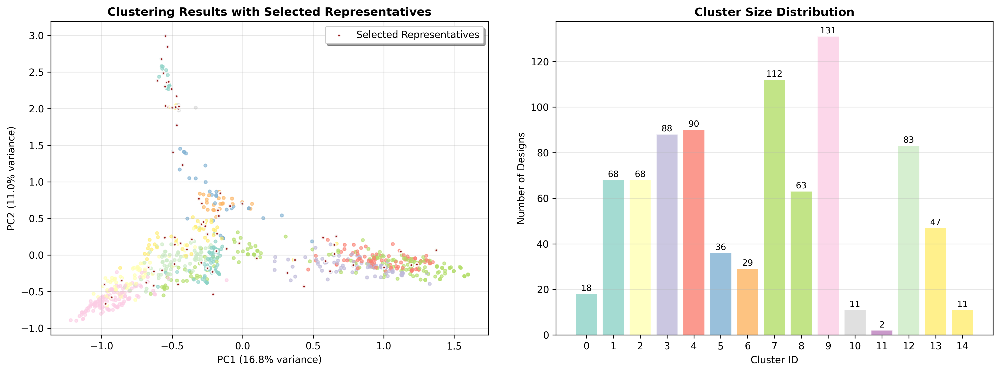

# ForgeHLS-benchmark

This project implements a multi-stage pipeline to select 80 representative and structurally diverse C++ files out of a large codebase (e.g., 900+ files). It combines lexical deduplication (MinHash + LSH), structural feature extraction (AST/CFG), and clustering + diversity maximization (e.g., farthest point sampling).

This is a part of HLS dataset work Forgehls.

## Method Intro



check [deep_research.md](cpp-benchmark-deduplicator/deep_research.md)

## How to use
```
python src/deduplicator_minhash.py -i data/data_of_designs_kernels.json -o results/MinHash --similarity-threshold 0.8

python src/deduplicator_clustering.py -i results/MinHash/after_minhash.json -o results/Clustering --target-min 80 --target-max 120

python src/simple_extract.py

cd results/GPT_reviews
python filter_json_by_csv.py
```

## Result
results/GPT_reviews/after_gpt_review.json

Index of Benchmarks: 

```csv
algo_name,source_name
bfs_queue,MachSuite
backprop,MachSuite
md_grid,MachSuite
spmv_ellpack,MachSuite
aes,MachSuite
adc_24bit,operators
temperature_based_shutdown,hls_algorithms
ethernet_mac_controller,hls_algorithms
video_display_processor,rtl_chip
dot_product,hls_algorithms
attention_augmented_convolution,ai_fpga_hls_algorithms
virtual_memory_management,hls_algorithms
gradient_clipping,ai_fpga_hls_algorithms
decision_tree_inference,hls_algorithms
temporal_difference_learning,ai_fpga_hls_algorithms
rc_oscillator,operators
rotate_array,leetcode_hls_algorithms
federated_differential_privacy,ai_fpga_hls_algorithms
federated_deep_learning,ai_fpga_hls_algorithms
ordinal_feature_scaling,ai_fpga_hls_algorithms
and_gate,operators
jk_flip_flop,operators
osd_processor,rtl_chip
robust_scaling,ai_fpga_hls_algorithms
universal_shift_register,rtl_module
modified,Vitis-HLS-Introductory-Examples-flatten
mips,CHStone
spam-filter,rosetta
sha,CHStone
using_C++_templates,Vitis-HLS-Introductory-Examples-flatten
using_free_running_pipeline,Vitis-HLS-Introductory-Examples-flatten
static_array_ROM,Vitis-HLS-Introductory-Examples-flatten
free_running_kernel_remerge_ii4to1,Vitis-HLS-Introductory-Examples-flatten
using_C++_templates_for_multiple_instances,Vitis-HLS-Introductory-Examples-flatten
aggregation_of_struct,Vitis-HLS-Introductory-Examples-flatten
federated_neural_architecture_search,ai_fpga_hls_algorithms
decoder_5to32,operators
cryptographic_rng,operators
fsm,hls_algorithms
video_controller,rtl_module
data_bus_32bit,operators
dma_controller,operators
jaccard_similarity,ai_fpga_hls_algorithms
dice_loss,ai_fpga_hls_algorithms
data_augmentation,ai_fpga_hls_algorithms
batch_renormalization,ai_fpga_hls_algorithms
roc_curve,ai_fpga_hls_algorithms
jensen_shannon_divergence,ai_fpga_hls_algorithms
iir_filter,hls_algorithms
nested_cross_validation,ai_fpga_hls_algorithms
struct_ii_issue,Vitis-HLS-Introductory-Examples-flatten
array_partition_block_cyclic,Vitis-HLS-Introductory-Examples-flatten
using_fifos,Vitis-HLS-Introductory-Examples-flatten
unsynchronized_io_maxi,Vitis-HLS-Introductory-Examples-flatten
burst_rw,Vitis-HLS-Introductory-Examples-flatten
BNN,rosetta
optical-flow,rosetta
laplace_approximation,ai_fpga_hls_algorithms
AES_Encrypt,operators
robust_optimization,ai_fpga_hls_algorithms
purity_score,ai_fpga_hls_algorithms
kullback_leibler_divergence,ai_fpga_hls_algorithms
lu_decomposition,hls_algorithms
cutmix,ai_fpga_hls_algorithms
inorder_traversal,leetcode_hls_algorithms
sample_rate_conversion,hls_algorithms
sha256,hls_algorithms
2mm,PolyBench
nussinov,PolyBench
correlation,PolyBench
deriche,PolyBench
atax,PolyBench
gemm,PolyBench
mlp,ai_fpga_hls_algorithms
spmv_crs,MachSuite
adc_8bit,operators
binary_search,hls_algorithms
gaussian_blur,hls_algorithms
i2c_master_slave_controller,hls_algorithms
dac_16bit,operators
```
